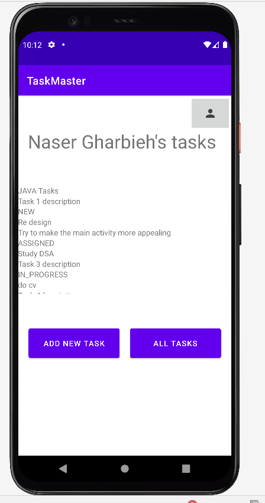
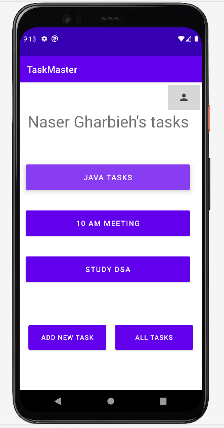
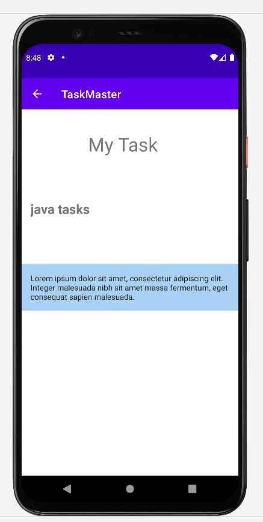

# taskmaster
# Beginning TaskMaster

| Homepage | All Tasks |
|:---:|:---:|
|  |  |
| Add Task | Added Task |
|  |  |
| user Settings | username Saved |
|  |  |
| Select task from Homepage | Task Details |
|  |  |

## description
Task master mobile application with three pages:
1. home page with two buttons and image:
  - Add new Task Button
  - All Tasks Button
2. AllTasks page:
 - Image
 - back button that back to home page.

3. AddNewTask page:
  - Add task button that show Task added Toast when clicked.
  - task description
  - task title

4. user Settings page:
  - edit text for username.
  - save button.

5. Task details page:
  - task title based on the clicked task.
  - lorem task description.

## daily change log
- Lab27
 1. Add Task Details page with two text views: task title and task description. Task title is passed from intent in the main when the task button clicked.

 2. Add Users Settings page with: edit text for the username and a save button. The username is passed using Shared Preferences to the home page.

- Lab28
1. Added a RecyclerView for displaying Task title, the tasks are hardcoded.

2. Created a Task class with attributes: title, body and state. The state is enum of type TaskState, and can be one of: “new”, “assigned”, “in progress”, or “complete”