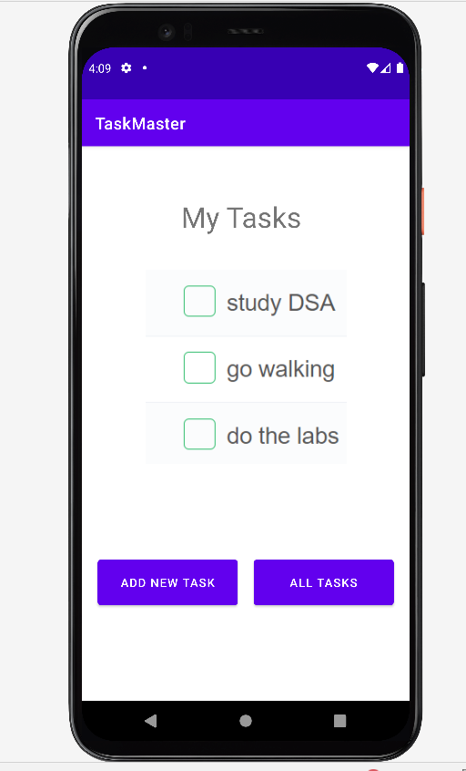
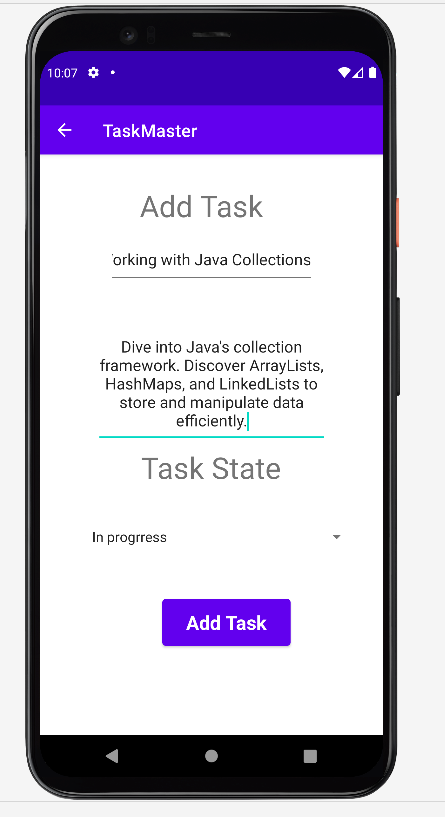
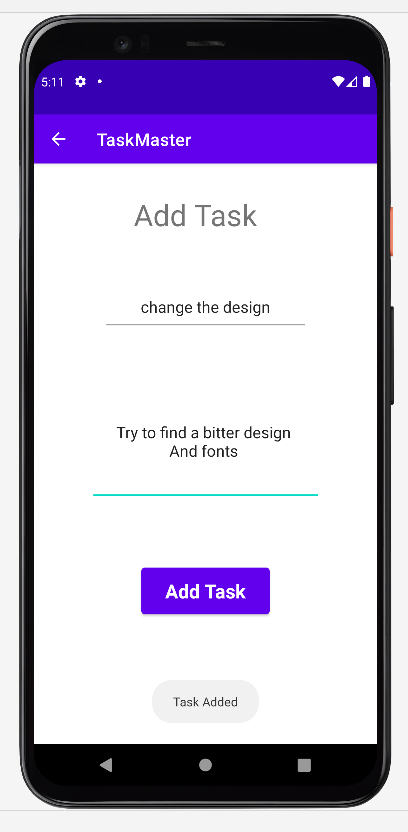

# taskmaster
# Beginning TaskMaster

| Homepage | All Tasks |
|:---:|:---:|
|  |  |
| Add Task | Added Task |
|  |  |

## description
Task master mobile application with three pages:
1. home page with two buttons and image:
  - Add new Task Button
  - All Tasks Button
2. AllTasks page:
 - Image
 - back button that back to home page.

3. AddNewTask page:
  - Add task button that show Task added Toast when clicked.
 - task description
 - task title

## daily change log
