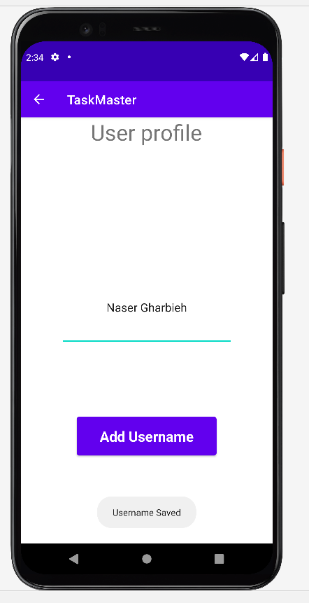

# taskmaster
# Beginning TaskMaster

| Homepage | All Tasks |
|:---:|:---:|
|  |  |
| Add Task | Added Task |
|  |  |
| user Settings | username Saved |
|  |  |
| Select task from Homepage | Task Edit |
|  |  | 
| Task Updated | Task Edited AWS |
|  |  |
| Select task from Homepage to delete | Task Edit |
|  |  | 
| home After Deletion |  |
|  |  |

| DynamoDB Working |
|:---:| 
|  |
|  | 

## Cognito Auth Workflow 
| Homepage | login Before Signup |
|:---:|:---:|
|  |  |
| Signup | verify |
|  |  |
| login after verify | home After Login |
|  |  |

## S3 Add task image Workflow 
| Homepage | Add Task |
|:---:|:---:|
|  |  |
| Edit task & Add task Image |pick Task Image  |
|  |  |
| Task Image Added |  |
|  |  |
| delete task Image| deleted task Image |
|  |  |

## description
Task master mobile application with six pages:
1. home page with two buttons and image:
  - Add new Task Button
  - All Tasks Button
2. AllTasks page:
 - Image
 - back button that back to home page.

3. AddNewTask page:
  - Add task button that show Task added Toast when clicked.
  - task description
  - task title

4. user Settings page:
  - edit text for username.
  - save button.

5. Task details page:
  - task title based on the clicked task.
  - task description.
  - task state.
6. Edit task page:
   - Update any selected task Attributes from the main Activity.
   - Delete any selected task  from the main Activity.  

## daily change log
- Lab27
 1. Add Task Details page with two text views: task title and task description. Task title is passed from intent in the main when the task button clicked.

 2. Add Users Settings page with: edit text for the username and a save button. The username is passed using Shared Preferences to the home page.

- Lab28
1. Added a RecyclerView for displaying Task title, the tasks are hardcoded.

2. Created a Task class with attributes: title, body and state. The state is enum of type TaskState, and can be one of: “new”, “assigned”, “in progress”, or “complete”

- Lab29
1. Set up Room, and modify Task class to be an Entity.
2. Modify Add Task form to save the data entered in as a Task in local database.
3. Refactor homepage RecyclerView to display all Task entities from database.

- Lab31
1. Did Espresso tests for these Activities :
   - Main Activity.
   - user Settings/profile .
   - Add Task.

- Lab32
1. Remove Room dependencies and room connections from the application.
2. Remove Room form these Activities :
   - Main Activity. 
   - Add Task.
3. Added Amplify to the project successfully
4. Saving tasks in Dynamo db (Add Task Activity) and showing (retrieve) them in the main Activity.

- Lab33
1. Create Team model and associate it with the Task (one team `has many` tasks,  task  `ownedBy` team).
2. Choose the team associated when creating a task, and filter the tasks on the main activity based on team.

- Lab 34
1. Created edit task Activity were the user can :
   - Update any selected task Attributes from the main Activity.
   - Delete any selected task  from the main Activity.

- Lab 36 : added Congnito project successfully
1. Created  Activities to :
   - Login .
   - Signup.
   - Verify Account.
2. changed the Main (home) to sute the user.

- Lab37 : Added S3 to project successfully

 1. In the Task Details Activity: allow th user to pick an image, **the picked image will be uploaded to S3 and attached with the task and rendered.**

 2. Update the Task model to include a image of type string.
